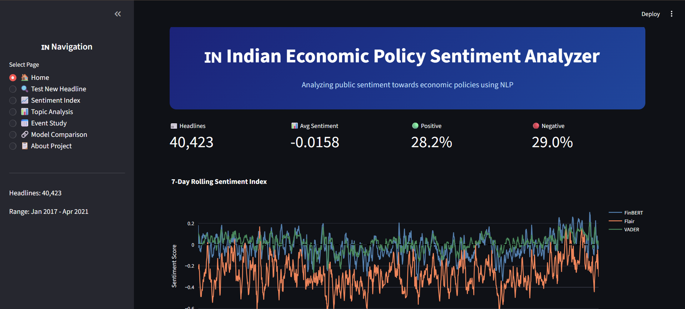
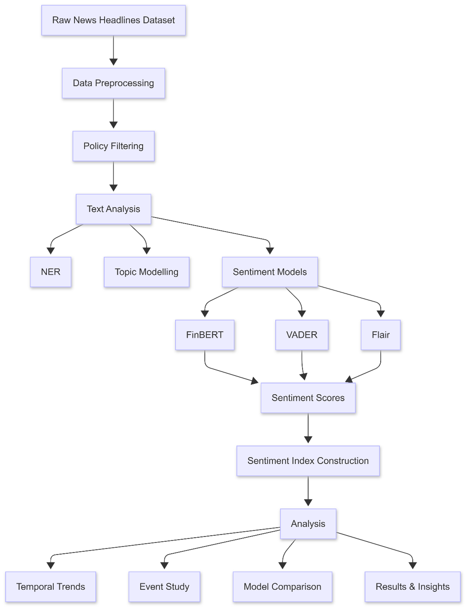

# 🇮🇳 Indian Economic Policy Sentiment Analysis

An interactive NLP dashboard for analyzing sentiment trends in Indian economic policy news headlines using FinBERT, VADER, BERTopic, and Streamlit.


---

# 📌 Overview

This project analyzes Indian economic policy news headlines from 2017 to 2021 and constructs a time-based sentiment index to track how media perception changes over time.

The system combines:

* **FinBERT** for financial sentiment analysis
* **VADER** for rule-based benchmarking
* **BERTopic** for topic discovery
* **spaCy** for named entity recognition
* **Streamlit** for interactive visualization

The project processes more than 200,000 financial news headlines and filters policy-relevant content related to inflation, GST, fiscal deficit, employment, RBI policies, banking, and macroeconomic events.

---

# 🚀 Key Features

✅ Financial sentiment analysis using FinBERT  
✅ BERTopic-based topic modeling  
✅ Daily sentiment index construction  
✅ Event study around major economic events  
✅ Interactive Streamlit dashboard  
✅ Headline sentiment prediction  
✅ Headline vs full-text sentiment comparison  
✅ Multi-model comparison using FinBERT, VADER, and Flair

---

# 📊 Dataset

* **Dataset:** India Financial News Sentiment Analysis
* **Source:** Kaggle
* **Total Headlines:** 200,500
* **Policy-Relevant Headlines:** 40,423
* **Time Period:** January 2017 – April 2021

### News Sources

* Economic Times
* MoneyControl
* Livemint
* Business Today
* Financial Express
* New York Times
* Wall Street Journal
* Washington Post

See `data/README_data.md` for dataset setup instructions.

---

# 🛠️ Methodology

```text
Raw Financial News Headlines
            ↓
Data Cleaning & Preprocessing
            ↓
Policy Keyword Filtering
            ↓
Named Entity Recognition (spaCy)
            ↓
BERTopic Topic Modeling
            ↓
Sentiment Analysis
   ├── FinBERT
   ├── VADER
   └── Flair
            ↓
Daily Sentiment Index Construction
            ↓
Event Study & Topic Analysis
            ↓
Interactive Streamlit Dashboard
```

---

# 📈 Key Results

| Metric                              | Value  |
| ----------------------------------- | ------ |
| Headlines Analyzed                  | 40,423 |
| Topics Identified                   | 79     |
| Days Covered                        | 1,552  |
| FinBERT–VADER Agreement             | 72.87% |
| Headline vs Full Text Agreement     | 65.9%  |
| Articles Scraped in Extension Study | 1,945  |

---

# 🔍 Major Findings

* Employment and fiscal deficit headlines showed the most negative sentiment
* GST-related coverage was relatively positive
* The 2019 corporate tax cut produced the strongest positive sentiment spike
* COVID-19 lockdown generated the sharpest negative sentiment decline
* Headlines and full articles often differed significantly in sentiment

---

# 🖥️ Dashboard Modules

The Streamlit dashboard includes:

* 🏠 **Home Dashboard** — Overview metrics and sentiment trends
* 🔍 **Test New Headline** — Real-time sentiment prediction
* 📈 **Sentiment Index** — Historical sentiment visualization
* 📊 **Topic Analysis** — Sentiment across policy categories
* 📅 **Event Study** — Analysis around major economic events
* 🔗 **Model Comparison** — FinBERT vs VADER vs Flair
* 📋 **About Project** — Methodology and project details

---

# 📸 Project Preview

## 🏠 Streamlit Dashboard



## 🛠️ System Architecture



---

# ⚙️ Run Locally

## Clone Repository

```bash
git clone https://github.com/YOUR_USERNAME/indian-economic-policy-sentiment-analysis.git

cd indian-economic-policy-sentiment-analysis
```

## Install Dependencies

```bash
pip install -r requirements.txt
```

## Launch Streamlit Dashboard

```bash
streamlit run app.py
```

The application will launch locally in your browser.

---

# 🧠 Models & Tools Used

| Tool / Model | Purpose                       |
| ------------ | ----------------------------- |
| FinBERT      | Financial sentiment analysis  |
| VADER        | Rule-based sentiment baseline |
| Flair        | Pre-existing sentiment labels |
| BERTopic     | Topic modeling                |
| spaCy        | Named entity recognition      |
| Plotly       | Interactive visualizations    |
| Streamlit    | Local dashboard deployment    |

---

# 📂 Repository Structure

```text
indian-economic-policy-sentiment-analysis/
│
├── app.py
├── requirements.txt
├── README.md
├── LICENSE
├── .gitignore
│
├── notebooks/
│   ├── 01_main_analysis.ipynb
│   └── 02_extension_study.ipynb
│
├── results/
│   ├── sentiment_index_timeline.png
│   ├── wordclouds.png
│   ├── topic_sentiment_heatmap.png
│   ├── topic_sentiment_boxplot.png
│   ├── aspect_sentiment.png
│   ├── event_study_sentiment.png
│   └── headline_vs_fulltext.png
│
├── assets/
│   ├── home_dashboard.png
│   └── methodology_flowchart.png
│
└── data/
    └── README_data.md
```

---

# ⚠️ Limitations

* Analysis is based primarily on headlines rather than full article text
* Dataset is static and limited to 2017–2021
* No manually annotated ground truth labels were available
* English-language sources only

---

# 🔭 Future Improvements

* Real-time news integration using APIs
* Full article sentiment analysis
* Fine-tuning FinBERT on Indian financial news
* Correlation with macroeconomic indicators
* Multilingual news support
* Deployment using live news APIs

---

# 👩‍💻 Author

**Madhyama Singh**
B.Sc. Economics & Data Analytics
CHRIST (Deemed to be University), Delhi NCR

---

# 📜 License

This project is licensed under the MIT License.
